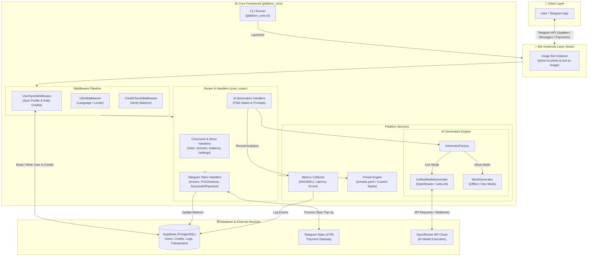
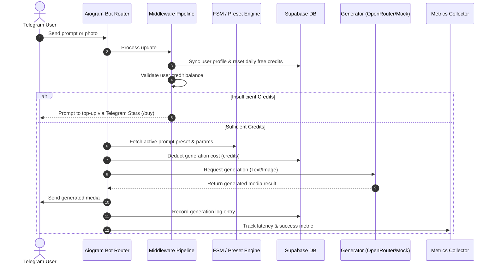

# Extensible Telegram AI Bot Platform 🚀

A modular, clean, and production-ready Python platform powered by **`uv`**, **`aiogram 3.x`**, **`Supabase`**, **`OpenRouter / LiteLLM`**, and **`Telegram Stars (XTR)`** monetization.

## 📌 Architecture Overview

- **Bot Instances (`bots/`)**: Modular bot definitions. Includes `image_bot` (photo-to-photo & prompt image generation).
- **Database (`Supabase`)**: PostgreSQL storing user profiles, active prompt states, generation logs, metric events, and Telegram Star transaction history.
- **Monetization (`Telegram Stars`)**: In-bot star package top-ups (`/buy`, `/stars`) with daily free credit refresh logic.
- **Metrics & Analytics**: Built-in event collector logging commands, button clicks, generation latency, DAU/MAU, and error rates.

## 📊 System Architecture & Flow

### High-Level System Architecture



### AI Generation Request & Credit Flow



## ⚙️ Multi-Instance Configuration (`instances/*.yaml`)

Each Telegram bot instance is configured independently using a YAML file placed in the `instances/` directory.

### Adding a New Bot Instance

To create a new bot instance (e.g. `instances/image_bot_2.yaml`):

```yaml
bot_id: "image_bot_2"
token_env: "IMAGE_BOT_2_TOKEN" # Environment variable holding the bot token
constants:
  daily_free_credits: 5
  default_generation_cost: 1
  bot_title: "Anime & Fantasy Art Creator"

modules:
  - name: "monetization"
    enabled: true
    options:
      daily_free_credits: 5
  - name: "image_gen"
    enabled: true
    options:
      default_model: "stability-ai/sdxl"

presets:
  - id: "anime_masterpiece"
    title: "Anime Masterpiece"
    description: "Vibrant Japanese anime art style"
    prompt_template: "Anime artwork, digital painting, Studio Ghibli style, {user_prompt}"
    category: "Anime"
    icon: "🎨"
```

### Managing Instances via CLI

- **List all configured instances**:
  ```bash
  uv run python -m platform_core.cli list
  ```

- **Run a specific instance**:
  ```bash
  uv run python -m platform_core.cli start image_bot_1 --mock
  ```

- **Run all configured instances concurrently**:
  ```bash
  uv run python -m platform_core.cli start all --mock
  ```

---

## ☸️ Kubernetes Deployment (`k8s/`)

Deploy the entire platform effortlessly to any Kubernetes cluster (Minikube, K3s, Kind, GKE, EKS, AKS) using Kustomize:

```bash
kubectl apply -k k8s/
```

- 📄 **Complete Kubernetes Guide**: Read [`docs/KUBERNETES_DEPLOYMENT.md`](file:///Users/stasbokun/prog/telegram-bots/docs/KUBERNETES_DEPLOYMENT.md) for full instructions on Secrets, Ingress, Pod scaling, and Health checks.

---

## 🚀 GitHub Actions Manual Deployment Workflow

A manual workflow is configured in [`.github/workflows/deploy.yml`](file:///.github/workflows/deploy.yml).

### How to Deploy

1. Go to your GitHub repository -> **Actions** tab -> **Deploy Telegram Bot Instances**.
2. Click **Run workflow**.
3. Select parameters:
   - **Target Environment**: `production`, `staging`, or `dev`
   - **Bot Instance**: `all`, `image_bot_1`, `image_bot_2`, or a specific bot ID.
   - **Deployment Strategy**:
     - `docker-compose`: Builds & verifies Docker image locally/in CI.
     - `ssh-remote`: Triggers automated remote server pull & `docker compose up -d --build`.
     - `dry-run-test`: Runs pytest and validates instance YAML files without deploying.

## 🗄️ Self-Hosting Supabase Database

You can host your own Supabase database locally or on a remote server using Docker Compose.

- 📄 **Complete Setup Guide**: Read [`docs/SELF_HOSTING_SUPABASE.md`](file:///Users/stasbokun/prog/telegram-bots/docs/SELF_HOSTING_SUPABASE.md) for step-by-step instructions.
- 🗃️ **Database Schema Migration**: Run [`supabase/schema.sql`](file:///Users/stasbokun/prog/telegram-bots/supabase/schema.sql) in Supabase Studio SQL Editor or via `psql` to create the required tables (`users`, `user_balances`, `star_transactions`, `bot_events`, `generation_logs`).
- ⚙️ **Environment Setup**: Set `SUPABASE_URL=http://localhost:8000` and `SUPABASE_KEY=<SERVICE_ROLE_KEY>` in your `.env` file.

## 🛠 Quick Start

1. Install dependencies with `uv`:
   ```bash
   uv venv
   source .venv/bin/activate
   uv pip install -e ".[dev]"
   ```

2. Copy `.env.example` to `.env` and add your tokens:
   ```bash
   cp .env.example .env
   ```

3. List configured bot instances:
   ```bash
   uv run python -m platform_core.cli list
   ```

4. Run all instances in Mock Mode (offline, zero API cost):
   ```bash
   uv run python -m platform_core.cli start all --mock
   ```

5. Run Tests:
   ```bash
   uv run pytest
   ```
