# 🗺️ Telegram AI Bot Platform: Release Roadmap & Version Plan

This document outlines the **multi-phase product and engineering roadmap**, versioning milestones, technical deliverables, and release management lifecycle for the **Telegram AI Bot Platform**.

---

## 🧭 Roadmap Overview & Version Timeline

```mermaid
timeline
    title Telegram AI Bot Platform Release Trajectory
    section v0.1.0 Foundation
        Core Architecture : Aiogram 3.x, YAML Instances, LiteLLM / OpenRouter
        Async Layer : Redis Streams, Consumer Worker, FSM Storage
        Observability : Prometheus, Loki, Promtail, Grafana
        CI/CD : Split GitHub Actions Workflows & Docker Compose
    section v0.2.0 Hardening
        Resilience & Security : Webhook Secret Validation, Rate Limiting, Circuit Breaker
        Media Cloud Storage : Cloudflare R2 / S3 Persistent Storage
        Bot UX Polish : Telegram Bot Father Command Sync, Rich Progress Feedback
        QA & Testing : E2E Automated Bot Smoke Tests & Load Benchmarks
    section v0.3.0 Monetization & Growth
        Telegram Stars (XTR) : Complete Transaction Ledger & Dispute Reconciliation
        Viral Growth Engine : Referral System & Bonus Credit Multipliers
        Retention Mechanics : Daily Check-in Streaks & Retention Push Notifications
        Global Reach : Complete i18n Localization (EN, ES, RU, DE, etc.)
    section v0.4.0 Multi-Modal & AI Studio
        Audio & Voice : Whisper Voice-to-Prompt Transcriber
        Video Generation : Luma / Runway / Kling Text-to-Video Integration
        Preset Studio : Dynamic Style Generator, Negative Prompts, Aspect Ratios
        Admin Portal : Fast Web Dashboard for Presets, Metrics & User Management
    section v1.0.0 General Availability (GA)
        Scale & Orchestration : Kubernetes (HPA, Ingress, Cert-Manager)
        Multi-Tenant Engine : Launch New Specialized Bots via Declarative Config
        Zero-Downtime Releases : Blue/Green & Canary Deployments
        Public Launch : Commercial Readiness & Complete Developer Documentation
```



---

## 📦 Detailed Milestone & Version Breakdown

---

### 🟢 Phase 1: v0.1.0 — Foundation & Architecture Core (Current Status: ~95% Complete)

> **Objective**: Establish the core microservice architecture, multi-instance orchestration, generation engine, and foundational telemetry.

#### ✅ What We Have Built:
- **Modular Core**: `platform_core` architecture decoupled from individual bot routers.
- **Multi-Instance Declarative Configs**: YAML-driven bot instantiation (`instances/*.yaml`) executed via `bot-cli`.
- **AI Routing Engine**: LiteLLM / OpenRouter integration with automatic fallback between text-to-image and multimodal photo-to-photo generation.
- **Async Execution Pipeline**: Redis Stream task broker (`platform_core/queue/`) with persistent consumer group worker pool.
- **Hybrid Database**: Self-hosted Supabase / PostgreSQL with fallback in-memory state repository.
- **Full Observability Stack**: Grafana dashboards, Prometheus metrics export (`:8000/metrics`), Loki + Promtail structured JSON log ingestion.
- **Decoupled CI/CD**: Staged GitHub Actions workflows (`deploy-bots.yml`, `deploy-monitoring.yml`, `deploy-database.yml`).

#### 🎯 Remaining v0.1.0 Polish:
1. Ensure all presets in `supabase/migrations/` and `instances/` are seeded and verified.
2. Finalize initial unit test coverage across all core modules (`pytest -v`).

---

### 🛡️ Phase 2: v0.2.0 — Production Hardening, Security & Media Persistence

> **Target Goal**: Make the platform battle-tested, secure against abuse, and eliminate ephemeral file dependencies.

#### 1. Persistent Media & Asset Storage
- [ ] **S3 / Cloudflare R2 Integration**:
  - Replace temporary base64/local disk media passing with Cloudflare R2 / AWS S3 presigned URLs.
  - Store generated user images with expiration policies (e.g., 30-day retention) to minimize disk bloat.
  - Provide users with persistent download links for high-res assets.

#### 2. Security & Anti-Abuse Hardening
- [ ] **Webhook Security**:
  - Implement Telegram Webhook Secret Token validation (`X-Telegram-Bot-Api-Secret-Token`).
  - IP whitelisting / reverse-proxy header trust validation.
- [ ] **Rate Limiting & Throttling**:
  - Redis token-bucket rate limiter per `user_id` and per `chat_id` (prevent bot flooding and spam).
  - Concurrency locks (prevent a user from spamming multiple heavy generation requests simultaneously).

#### 3. Reliability & Provider Circuit Breakers
- [ ] **AI Provider Resilience**:
  - Automatic fallback provider chain (e.g., if OpenRouter FLUX is down, failover to Stability AI or Recraft).
  - Exponential backoff retry with jitter on `429 Too Many Requests` or `503 Service Unavailable`.
- [ ] **Worker Health & Graceful Shutdown**:
  - Signal handling (`SIGTERM`/`SIGINT`) allowing in-flight generation jobs to finish before container stop.
  - Dead Letter Queue (DLQ) for failed Redis Stream messages with automated alerts.

#### 4. UX & Telegram Integration Polish
- [ ] **Automated Command Synchronization**:
  - Script/CLI command `bot-cli sync-commands` to auto-register bot commands (`/start`, `/generate`, `/presets`, `/buy`, `/help`) via Telegram's `setMyCommands` API.
- [ ] **Enhanced Generation Feedback**:
  - Real-time progress updates: *"🎨 Generating your image with FLUX... (Est. ~6s)"* with typing action triggers.

---

### 💰 Phase 3: v0.3.0 — Monetization, Retention & Growth Loops

> **Target Goal**: Turn the bots into self-sustaining, viral, and revenue-generating products using Telegram Stars.

#### 1. Complete Telegram Stars (XTR) Ledger
- [ ] **Transactional Ledger**:
  - Bulletproof invoice creation via `sendInvoice` using `currency="XTR"`.
  - Handle `pre_checkout_query` validations and `successful_payment` event logging.
  - Automatic credit balance top-ups with idempotency keys to prevent double-crediting.
  - Admin dispute and refund management webhooks.

#### 2. Growth & Viral Loops
- [ ] **Referral & Affiliate Engine**:
  - Deep-link `/start?ref=USER_ID` invite handling.
  - Reward structure: *"Invite a friend, you both get 5 free generation credits!"*.
  - Track referral conversions and top referrers in analytics.
- [ ] **Social Sharing Cards**:
  - Telegram inline share button on generated images: *"Generate yours with @AiImageBot"*.

#### 3. Retention & Engagement Mechanisms
- [ ] **Daily Streak Bonus**:
  - Incremental daily login rewards (e.g., Day 1 = 1 credit, Day 5 = 5 credits).
- [ ] **Re-engagement Scheduler**:
  - Celery/cron notification job: notify users when their daily free credits reset: *"🎁 Your 3 daily free credits are ready!"*.
- [ ] **Feedback & Quality Rating**:
  - Inline 👍 / 👎 rating buttons on generated media to log quality metrics to Prometheus/Grafana.

#### 4. Full Internationalization (i18n)
- [ ] **Dynamic Language Detection & Switcher**:
  - Read Telegram user language code (`user.language_code`).
  - `/language` command for manual override.
  - Complete translation coverage for English, Spanish, Russian, German, French, and Portuguese.

---

### 🔮 Phase 4: v0.4.0 — Multi-Modal Expansion & AI Preset Studio

> **Target Goal**: Expand beyond static image generation into rich multi-modal AI and empower admins with no-code control.

#### 1. Multi-Modal Pipelines
- [ ] **Voice-to-Prompt Transcriber**:
  - Transcribe Telegram voice notes into image prompts using OpenAI Whisper / Groq Whisper.
- [ ] **Text-to-Video / Image-to-Video Generation**:
  - Integrate video generation APIs (e.g., Luma Dream Machine, Runway Gen-3, Kling) with async polling status.
- [ ] **Text-to-Speech (TTS)**:
  - ElevenLabs / OpenAI TTS support for voice response bots.

#### 2. Advanced Preset & Workflow Customizer
- [ ] **Dynamic Parameters in Telegram UI**:
  - Inline selectors for Aspect Ratio (`1:1`, `16:9`, `9:16`, `4:5`).
  - Negative prompt customizer and seed input for deterministic generation.
  - Style strength slider / LoRA selection.

#### 3. Central Web Admin Dashboard
- [ ] **Lightweight Web Control Panel**:
  - Live revenue and user growth analytics.
  - CRUD interface for bot presets, prompt templates, and promotional credit campaigns without redeploying code.
  - User management (ban abusive users, grant manual credits, inspect generation logs).

---

### 🚀 Phase 5: v1.0.0 — General Availability (GA) & Enterprise Scalability

> **Target Goal**: Production-grade scalability, Kubernetes orchestration, zero-downtime deployments, and multi-tenant hosting.

#### 1. Kubernetes & Infrastructure as Code
- [ ] Complete Helm chart / K8s manifests in `k8s/`:
  - Horizontal Pod Autoscaler (HPA) for AI Workers based on Redis queue depth.
  - Ingress controller with automated TLS certificates (Cert-Manager / Let's Encrypt).
  - Dedicated Redis cluster / managed PostgreSQL replication.

#### 2. Multi-Tenant Whitelabel Bot Platform
- [ ] Support external creators hosting their own Telegram bot on our platform infrastructure via token injection.
- [ ] Custom billing splits and revenue sharing per bot instance.

#### 3. Enterprise Operations & Release Governance
- [ ] Blue/Green zero-downtime deployment pipelines in GitHub Actions.
- [ ] Automated disaster recovery and automated daily database backups to cold storage.
- [ ] Full public documentation, API specs, and runbooks.

---

## 📈 Release Tracking & Definition of Done (DoD)

To maintain high development velocity without losing quality, every release follows this structured checklist:

### Definition of Done Checklist:
| Area | Verification Requirement |
| :--- | :--- |
| **Code Quality** | Ruff linting passes (`ruff check .`), type checks pass (`mypy platform_core`), zero dead code. |
| **Automated Tests** | 100% unit tests passing (`pytest tests/`). Mock generation tests verified. |
| **Telemetry** | Every new event/route logs JSON structured data to Loki and emits Prometheus metrics. |
| **Database Migrations** | Idempotent SQL migration script created in `supabase/migrations/` and verified with `down` rollback. |
| **Configuration** | Environment variables updated in `.env.example` and documented in `README.md`. |
| **Deployment** | Docker containers build cleanly (`docker compose build`) without layer cache corruption. |
| **Release Tagging** | Semantic Git tag created (`vX.Y.Z`) with auto-generated GitHub Release Changelog. |

---

## 🔄 Git Branching & Release Pipeline

```mermaid
gitgraph
    commit id: "v0.1.0-init"
    branch develop
    checkout develop
    commit id: "feature/r2-storage"
    commit id: "feature/rate-limiter"
    branch release/v0.2.0
    checkout release/v0.2.0
    commit id: "bump-version-0.2.0"
    commit id: "e2e-smoke-test"
    checkout main
    merge release/v0.2.0 tag: "v0.2.0"
    checkout develop
    merge release/v0.2.0
    commit id: "feature/stars-ledger"
    branch release/v0.3.0
    checkout release/v0.3.0
    commit id: "bump-version-0.3.0"
    checkout main
    merge release/v0.3.0 tag: "v0.3.0"
```

1. **`main`**: Production-ready code only. Direct commits disabled. Tags trigger deployment workflows.
2. **`develop`**: Active integration branch for upcoming minor versions.
3. **`feature/*`**: Short-lived branches for specific roadmap tasks.
4. **`release/vX.Y.Z`**: Stabilization branch for QA and version bumping before merging into `main`.

---

## 📋 Immediate Action Plan (What to do right now):

1. **Close out v0.1.0**: Tag `v0.1.0` in Git to mark the current foundation as stable baseline.
2. **Sprint to v0.2.0**:
   - Step 1: Implement Cloudflare R2 / S3 persistent storage for generated media.
   - Step 2: Implement Redis token-bucket rate limiting and anti-spam locks.
   - Step 3: Implement Webhook secret token validation and automatic command sync.
3. **Sprint to v0.3.0**: Focus entirely on Telegram Stars monetization, viral referral loop, and daily streak rewards.
