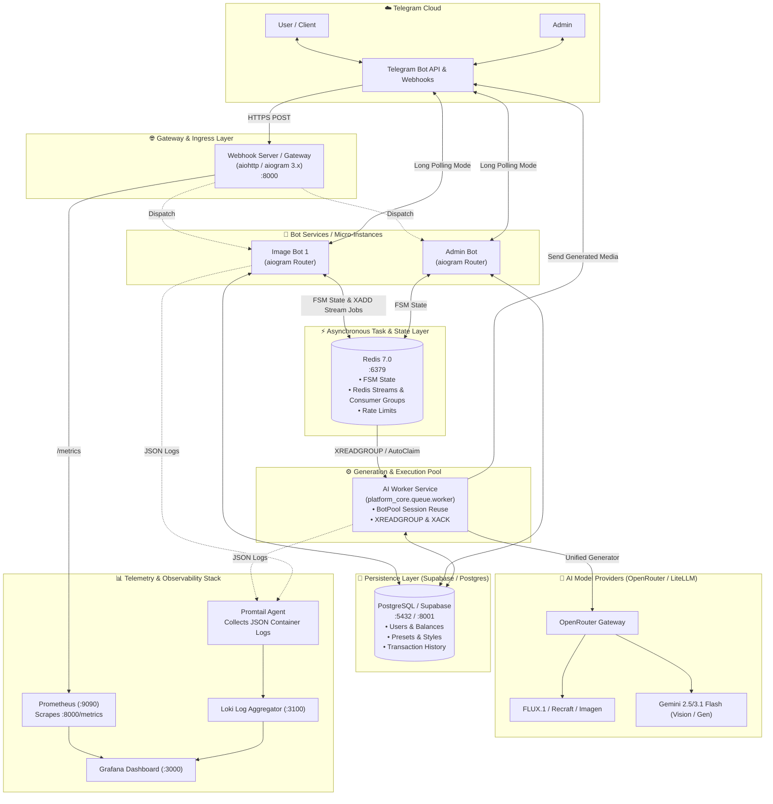
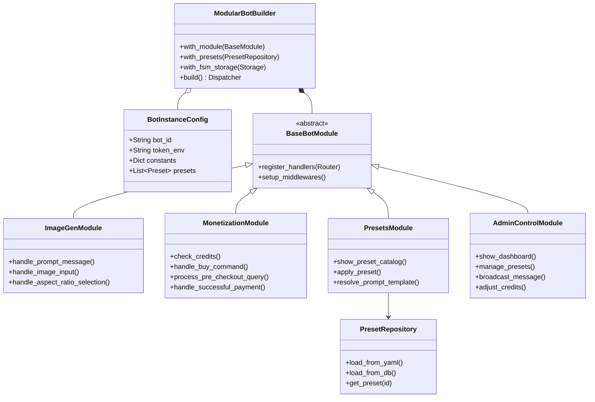
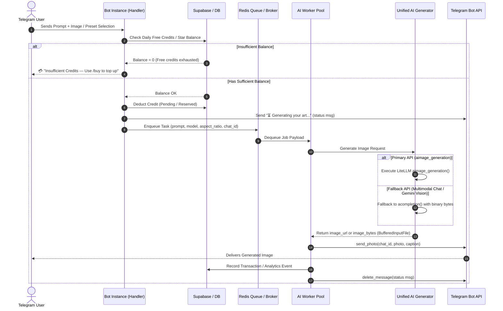
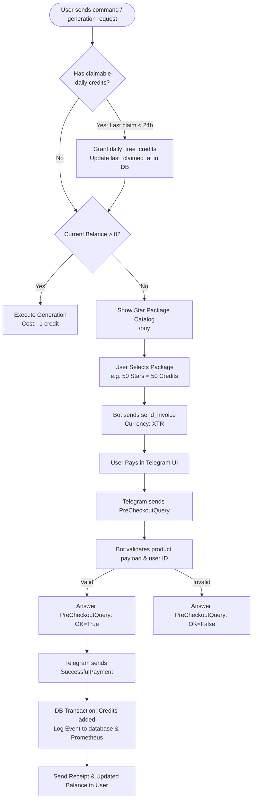
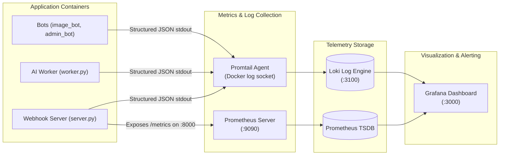
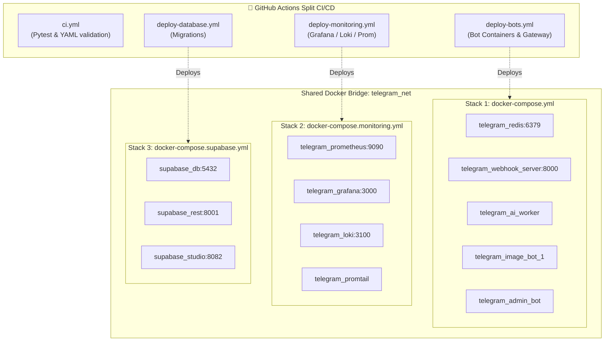

# 📐 System Architecture & Sub-Architectures

This document provides visual diagrams and detailed explanations of the **Telegram AI Bot Platform** high-level architecture, module composition, execution flows, monetization, observability, and deployment topologies.

---

## 📑 Table of Contents

1. [High-Level System Architecture](#1-high-level-system-architecture)
2. [Bot Modular Architecture & Class Composition](#2-bot-modular-architecture--class-composition)
3. [Request & AI Generation Lifecycle](#3-request--ai-generation-lifecycle)
4. [Telegram Stars (XTR) Monetization & Credit Engine](#4-telegram-stars-xtr-monetization--credit-engine)
5. [Observability & Telemetry Pipeline](#5-observability--telemetry-pipeline)
6. [Deployment & Multi-Stack Infrastructure Topology](#6-deployment--multi-stack-infrastructure-topology)

---

## 1. High-Level System Architecture

The platform is designed as a decoupled, microservice-based architecture running across containerized stacks on a shared bridge network (`telegram_net`).

---

## 2. Bot Modular Architecture & Class Composition

Every bot instance is composed of reusable modules via the `ModularBotBuilder` pattern and configured by instance YAML descriptors.

---

## 3. Request & AI Generation Lifecycle

Detailed end-to-end sequence of a user submitting an image generation prompt, credit validation, background queueing, worker execution, fallback resolution, and media delivery.

---

## 4. Telegram Stars (XTR) Monetization & Credit Engine

The monetization model incorporates daily replenishing credits, package purchases using Telegram's native Stars currency (`XTR`), pre-checkout query validations, and idempotent balance updates.

---

## 5. Observability & Telemetry Pipeline

How metrics and logs flow from containers to Prometheus, Promtail, Loki, and Grafana.

---

## 6. Deployment & Multi-Stack Infrastructure Topology

Independent Docker Compose stacks and GitHub Actions CI/CD workflows coordinate deployments without cross-service downtime.

